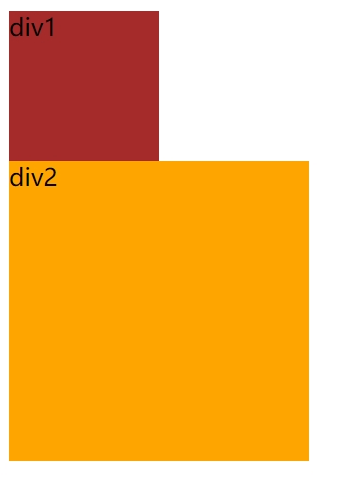
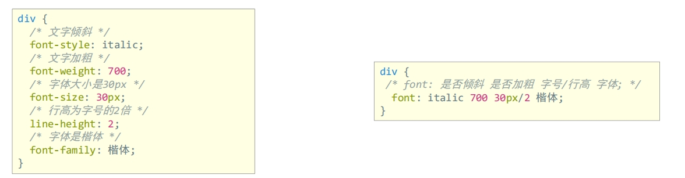
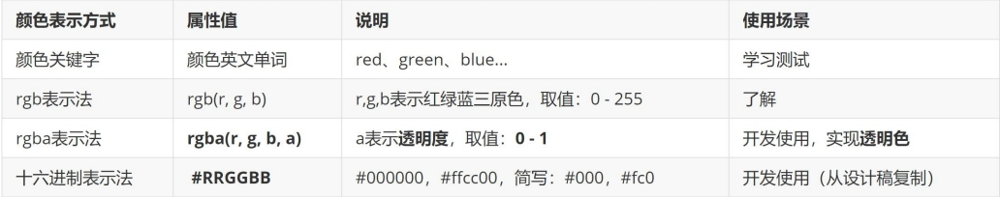
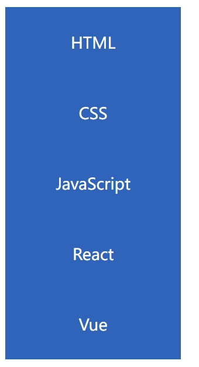
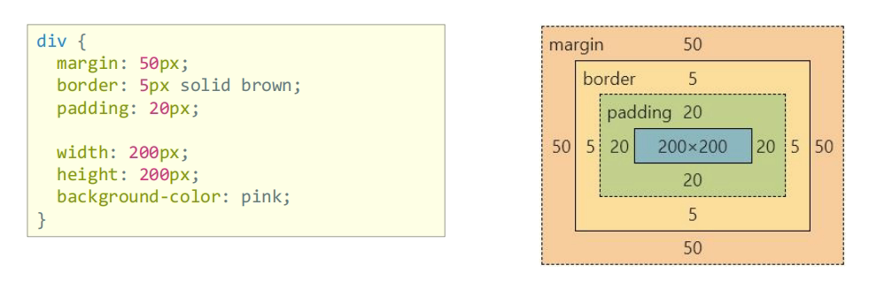
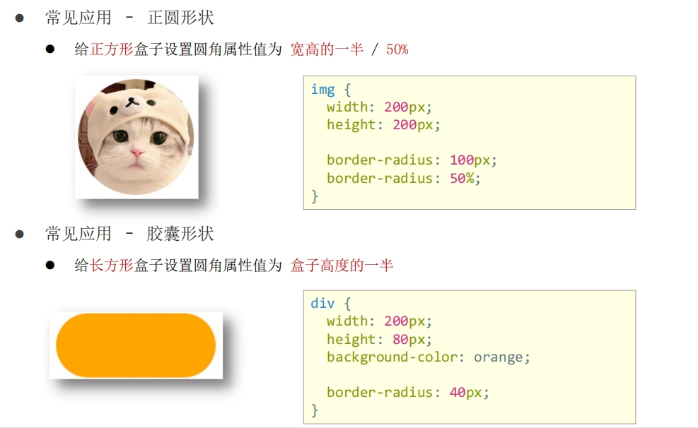

# CSS

[TOC]

## CSS 定义

层叠样式表 (Cascading Style Sheets，缩写为 CSS），是一种 样式表 语言，用来描述 HTML 文档的呈现（美化内容）。

## CSS 引入

### 内部样式表 - `style`

```HTML
<!DOCTYPE html>
<html lang="en">
<head>
  <meta charset="UTF-8">
  <meta http-equiv="X-UA-Compatible" content="IE=edge">
  <meta name="viewport" content="width=device-width, initial-scale=1.0">
  <title>初识 CSS</title>
  <style>
    p {
      color: red; /* 文字颜色 */
      font-size: 30px;  /* 字号 */
    }
  </style>
</head>
<body>
  <p>体验 CSS</p>
</body>
</html>
```

css 代码写在 style 标签里面,常用与学习使用

### 外部样式表 - `link`

CSS 代码写在单独的 CSS 文件中（.css）， 在 HTML 使用 link 标签引入,开发使用

```html
my.css 文件内容
p {
  color: red;
}

<!DOCTYPE html>
<html lang="en">
<head>
  <meta charset="UTF-8">
  <meta http-equiv="X-UA-Compatible" content="IE=edge">
  <meta name="viewport" content="width=device-width, initial-scale=1.0">
  <title>CSS 引入方式</title>
  <!-- link 引入外部样式表； rel：关系，样式表 -->
  <link rel="stylesheet" href="./my.css">
</head>
<body>
  <p>这是 p 标签</p>
</body>
</html>
```

### 行内样式表 - `style`

CSS 写在标签的 style 属性值里， 配合 JavaScript 使用

```html
<!DOCTYPE html>
<html lang="en">
<head>
  <meta charset="UTF-8">
  <meta http-equiv="X-UA-Compatible" content="IE=edge">
  <meta name="viewport" content="width=device-width, initial-scale=1.0">
  <title>CSS 引入方式</title>
</head>
<body>
  <p>这是 p 标签</p>
  <!-- 行内，style=" CSS" -->
  <div style="color: green; font-size: 30px;">这是 div 标签</div>
</body>
</html>
```

## 选择器

### 标签选择器

标签选择器：使用标签名作为选择器 → 选中同名标签设置相同的样式。
- 特点：选中同名标签设置相同的样式，无法差异化同名标签的样式
```html
<!DOCTYPE html>
<html lang="en">
<head>
  <meta charset="UTF-8">
  <meta http-equiv="X-UA-Compatible" content="IE=edge">
  <meta name="viewport" content="width=device-width, initial-scale=1.0">
  <title>标签选择器</title>
  <style>
    p {
      color: red;
    }
  </style>
</head>
<body>
  <p>这是 p 标签</p>
  <p>1111</p>
  <p>2222</p>
</body>
</html>
```

### 类选择器

查找标签，差异化设置标签的显示效果,为相同的标签设置不同的类名， `class = "CLASSNAME"`

```HTML
<!DOCTYPE html>
<html lang="en">
<head>
  <meta charset="UTF-8">
  <meta http-equiv="X-UA-Compatible" content="IE=edge">
  <meta name="viewport" content="width=device-width, initial-scale=1.0">
  <title>类选择器</title>
  <style>
    .red {
      color: red;
    }

    .size {
      font-size: 50px;
    }
  </style>
</head>
<body>
  <!-- 一个类选择器可以给多个标签使用 -->
  <p class="red">111111</p>
  <p>222222</p>
  <!-- 一个标签可以使用多个类名，class属性值写多个类名，类名用空格隔开 -->
  <div class="red size">div 标签</div>
</body>
</html>
```

### id选择器

：查找标签，差异化设置标签的显示效果, 一般配合 JavaScript 使用，很少用来设置 CSS 样式。同一个 id 选择器在一个页面只能使用一次

```HTML
<!DOCTYPE html>
<html lang="en">
<head>
  <meta charset="UTF-8">
  <meta http-equiv="X-UA-Compatible" content="IE=edge">
  <meta name="viewport" content="width=device-width, initial-scale=1.0">
  <title>id选择器</title>
  <style>
    /* 定义 */
    #red {
      color: red;
    }
  </style>
</head>
<body>
  <!-- 使用 -->
  <div id="red">div 标签</div>
</body>
</html>
```

### 通配符选择器

作用：查找页面所有标签，设置相同样式。

通配符选择器： *，不需要调用，浏览器自动查找页面所有标签，设置相同的样式

通配符选择器可以用于清除标签的默认样式，例如：标签默认的外边距、内边距

```HTML
<!DOCTYPE html>
<html lang="en">
<head>
  <meta charset="UTF-8">
  <meta http-equiv="X-UA-Compatible" content="IE=edge">
  <meta name="viewport" content="width=device-width, initial-scale=1.0">
  <title>通配符选择器</title>
  <style>
    * {
      color: red;
    }
  </style>
</head>
<body>
  <p>p 标签</p>
  <div>div 标签</div>
  <h1>h1 标签</h1>
  <ul>
    <li>li</li>
    <li>li</li>
    <li>li</li>
  </ul>
  <strong>strong</strong>
</body>
</html>
```

### 复合选择器

由两个或多个基础选择器，通过不同的方式组合而成，可以更准确更高效的选择目标元素

#### 后代选择器
选中某元素的后代元素, `父选择器 子选择器 { CSS 属性}`，父子选择器之间用空格隔开。
```html
<style>
div span {
    color: red;
}
</style>

...
<body>
    <span> span 标签</span>
    <div>
    <span>这是 div 的儿子 span</span >
    </div>
</body>
...
```

#### 子代选择器

子代选择器：选中某元素的子代元素（最近的子级）。选择器写法：`父选择器 > 子选择器 { CSS 属性}`，父子选择器之间用 > 隔开。

```HTML
<style>
div > span {
    color: red;
}
</style>
```

#### 并集选择器
并集选择器：选中多组标签设置相同的样式. 选择器写法：`选择器1, 选择器2, …, 选择器N { CSS 属性}`，选择器之间用 , 隔开

```html
<style>
    div,
    p,
    span {
        color: red;
    }
</style>
<div> div 标签</div>
<p>p 标签</p>
<span>span 标签</sp
```

#### 伪类选择器

```html
<!DOCTYPE html>
<html lang="en">
<head>
  <meta charset="UTF-8">
  <meta http-equiv="X-UA-Compatible" content="IE=edge">
  <meta name="viewport" content="width=device-width, initial-scale=1.0">
  <title>伪类选择器</title>
  <style>
    /* 任何标签都可以设置鼠标悬停的状态 */
    a:hover {
      color: red;
    }

    /* div:hover */
    .box:hover {
      color: green;
    }
  </style>
</head>
<body>
  <a href="#">a 标签，超链接</a>
  <div class="box">div 标签</div>
</body>
</html>
```

#### 伪类超链接

```html
<!DOCTYPE html>
<html lang="en">
<head>
  <title>Document</title>
  <style>
    a:link {
      color: pink; /*访问前*/
    }
    a:visited {
      color: gray; /*访问后*/
    }
    a:hover {
      color: red; /*鼠标悬停*/
    }
    a:active {
      color: blue; /*点击时*/
    }
  </style>
</head>
<body>
  <a href="https://www.baidu.com">百度</a>
</body>
</html>
```

#### 结构伪类选择器

作用：根据元素的结构关系查找元素。

- E:first-child: 查找的一个E元素
- E:lastchild: 查找最后一个E元素
- E:nth-child(N): 查找第N个E元素(第一个元素N=1)
- E:nth-child(公式)
      - 偶数： 2n
      - 奇数： 2n+1;2n-1
      - 找到5的倍数： 5n
      - 找到地5个以后的标签：n+5

#### 伪元素选择器

- E::before : 在E元素前面添加一个伪装
- E::afer: 在E元素最后面添加一个伪元素
必须要设置 content，如果content没有内容，可以引号留空
```html
<!DOCTYPE html>
<html lang="en">
<head>
    <meta charset="UTF-8">
    <meta name="viewport" content="width=device-width, initial-scale=1.0">
    <title>Document</title>
    <style>
        div::before {
            content: "before";
            background-color: yellow;
            width: 18px;
        }
        div::after {
            content: "after";
            background-color: red;
        }
    </style>
</head>
<body>
    <div>这是一个伪装元素示例</div>
</body>
</html>
```

## 画盒子

目标：使用合适的选择器画盒子



```html
<!DOCTYPE html>
<html lang="en">
<head>
  <meta charset="UTF-8">
  <meta http-equiv="X-UA-Compatible" content="IE=edge">
  <meta name="viewport" content="width=device-width, initial-scale=1.0">
  <title>画盒子</title>
  <style>
    .red {
      /* 宽度 */
      width: 100px;
      /* 高度 */
      height: 100px;
      /* 背景色 */
      background-color: brown;
    }

    .orange {
      width: 200px;
      height: 200px;
      background-color: orange;
    }
  </style>
</head>
<body>
  <div class="red">div1</div>
  <div class="orange">div2</div>
</body>
</html>
```

## 文字控制属性 

- 字体大小： `font-size`
    - `font-size: 30px`, 谷歌浏览器默认字号是16px ，PC 端网页最常用的单位 px
- 文字粗细： `font-weight`
    - 正常： 400 或normal
    - 加粗： 700   或 bold
- 字体样式：`font-style`, 清除默认的倾斜效果
    - 正常： normal
    - 倾斜： italic
- 行高：`line-height`
    - 数字 + px
    - 数字（当前标签font-size属性值的倍数）
    - 垂直居中技巧：行高属性值等于盒子高度属性值
- 字体族：`font-family`, 执行顺序：从左向右依次查找
    - `font-family: Microsoft YaHei, Heiti SC, tahoma, arial, Hiragino Sans GB, "\5B8B\4F53", sans-serif;`

- font 复合属性: 
    - 将多个属性合并成一行 `font: italic 700 30px/2 楷体;`  是否倾斜 是否加粗 字号/行高 字体;
    
    - 字号和字体值必须书写，否则 font 属性不生效

- 文本缩进： `text-indent`
      - 数字 + px
      - 数字 + em（推荐：1em = 当前标签的字号大小）：text-indent: 2em;

- 文本对齐方式： `text-align`
      - left: 左对齐
      - center： 居中对齐
      - right： 右对齐

- 文本修饰线：`text-decoration`
      - none: 无
      - underline： 下划线
      - line-through： 删除线
      - overline 上划线

## color 文字颜色



## 背景属性

### 背景色 - `background-color`
### 背景图 - `background-image（bgi）`
背景图默认有平铺（复制）效果
### 背景图平铺方式- `background-repeat`
- no-repeat: 不平铺
- repeat： 平铺,默认效果
- repeat-x: 水平方向平铺
- repeat-y: 垂直方向平铺

### 背景图位置 - `background-position`
- left
- right
- top
- bottom
- center

### 背景图缩放- `background-size`
- cover：等比例缩放背景图片以完全覆盖背景区，可能背景图片部分看不见
- contain：等比例缩放背景图片以完全装入背景区，可能背景区部分空白
- 百分比：根据盒子尺寸计算图片大小

### 背景图固定 - `background-attachment`

背景不会随着元素的内容滚动
- fixed

### 背景复合属性

属性值：背景色 背景图 背景图平铺方式 背景图位置/背景图缩放 背景图固定（空格隔开各个属性值，不区分顺序）

```html
div {
    width: 400px;
    height: 400px;
    background: pink url(./images/1.png) no-repeat right center/cover;
}
```

## 显示模式

布局网页的时候，根据标签的显示模式选择合适的标签摆放内容。

- 块级元素： 
    - 独占一行
    - 宽度默认是父级的100%
    - 添加宽高属性生效
- 行内元素
    - 一行可以显示多个
    - 设置宽高属性不生效,宽高尺寸由内容撑开
- 行内块元素
    - 一行可以显示多个
    - 设置宽高属性生效,宽高尺寸，也可以由内容撑开

### 转换显示模式- `display`

- block: 块级别
- inline-block: 行内块
- inline: 行内

### 综合案例-热词



```html
<!DOCTYPE html>
<html lang="en">
<head>
    <meta charset="UTF-8">
    <meta name="viewport" content="width=device-width, initial-scale=1.0">
    <title>Document</title>
    <style>
        a {
            display: block;
            width: 200px;
            height: 80px;
            background-color: #3064bb;
            color: #fff;
            text-decoration: none;
            text-align: center;
            line-height: 80px;
            font-size: 18px;
        }
        a:hover {
            background-color: #608dd9;
        }
    </style>
</head>
<body>
   <div>
        <a href="">HTML</a>
        <a href="">CSS</a>
        <a href="">JavaScript</a>
        <a href="">React</a>
        <a href="">Vue</a>
   </div>
</body>
</html>
```

## 盒子模型 

作用：布局网页，摆放盒子和内容

### 盒子模型 – 组成


盒子模型重要组成部分：
- 内容区域 – width & height 
- 内边距 – padding（出现在内容与盒子边缘之间）
- 边框线 – border
- 外边距 – margin（出现在盒子外面）

### 盒子模型 – 边框线-`border`

边框线粗细 线条样式 颜色（不区分顺序）- `border: 5px solid brown`
- solid: 实线
- dashed：虚线
- dotted： 点线

```html
div {
    border-top: 2px solid red;
    border-right: 3px dashed green;
    border-bottom: 4px dotted blue;
    border-left: 5px solid orange;
    width: 200px;
    height: 200px;
    background-color: pink;
}
```

### 盒子模型 – 内边距-`padding`

```HTML
div {
    /* 四个方向 内边距相同 */
    padding: 30px;
    /* 单独设置一个方向内边距 */
    padding-top: 10px;
    padding-right: 20px;
    padding-bottom: 40px;
    padding-left: 80px;
    width: 200px;
    height: 200px;
    background-color: pink;
}
```
padding 多值写法：
- 一个值 `padding: 10px;`: 四个方向均为10px
- 二个值： `padding： 10px 20px;`: 上下10px,左右20px
- 三个值：`padding: 10px 20px 30px;`: 上10px,左右20px, 下30px
- 四个值：`padding: 10px 20px 30px 40px;`:  上下左右

### 盒子模型 – 尺寸计算

由于 盒子尺寸 = 内容尺寸 + border尺寸 + 内边距尺寸，所有给盒子添加border /padding 会撑大盒子，为了保持盒子大小不不表，我们可以采取下面两种方式
- 手动做减法，减掉 border / padding 的尺寸
- 內减模式：`box-sizing: border-box`

### 盒子模型 – 外边距 - `margin`

技巧：版心居中 – 左右 margin 值 为 auto（盒子要有宽度）

### 盒子模型 – 元素溢出-`overflow`
- hidden: 溢出隐藏
- scroll： 溢出滚动，无论是否溢出，都显示滚动条位置
- auto: 溢出滚动：溢出时才显示滚动位置

### 外边距问题 – 合并现象
垂直排列的兄弟元素，上下 margin 会合并
- 取两个 margin 中的较大值生效

### 外边距问题 – 塌陷问题

父子级的标签，子级的添加 上外边距 会产生塌陷问题， 现象：导致父级一起向下移动

解决方法：
- 取消子级margin，父级设置padding
- 父级设置 overflow: hidden
- 父级设置 border-top

```HTML
<!DOCTYPE html>
<html lang="en">
<head>
    <meta charset="UTF-8">
    <meta name="viewport" content="width=device-width, initial-scale=1.0">
    <title>Document</title>
    <style>
        body {
            background-color: antiquewhite;
        }
        .father {
            padding: 20px;
            width: 180px;
            height: 180px;
            background-color: pink;
            box-sizing: border-box;
            overflow: hidden
        }
        .son {
            /* margin-top: 20px; */
            width: 80px;
            height: 80px;
            background-color: green;
        }
    </style>
</head>
<body>
    <div class="father">
        <div class="son"></div>
    </div> 
</body>
</html>
```

### 行内元素 – 内外边距问题

行内元素添加 margin 和 padding，无法改变元素垂直位置,解决方法：给行内元素添加 line-height 可以改变垂直位置

```html
  <style>
    span {
      margin: 50px;
      padding: 20px;
      line-height: 100px;
    }
  </style>
```

### 盒子模型 – 圆角 `border-radius`

作用：设置元素的外边框为圆角。
- 属性名：border-radius
- 属性值：属性值是圆角半径
    - 数字+px 
    - 百分比

- 一个值: `border-radius: 10px`: 四个角都为10px
- 二个值：  `border-radius: 10px 20px`: 左上右下：10px, 右上，左下： 20px
- 三个值： `border-radius: 10px 20px 30px` 左上 10px  右上+左下20px 右下 30px
- 四个值： `border-radius: 10px 20px 30px 40px` 

> 从左上角开始顺时针赋值，当前角没有数值则与对角取值相同。



### 盒子模型 – 阴影（拓展）

作用：给元素设置阴影效果
属性名：`box-shadow`
属性值：X 轴偏移量 Y 轴偏移量 模糊半径 扩散半径 颜色 内外阴影
注意：
• X 轴偏移量 和 Y 轴偏移量 必须书写
• 默认是外阴影，内阴影需要添加 inset

```html
div {
    width: 200px;
    height: 80px;
    background-color: orange;
    box-shadow: 2px 5px 10px 0 rgba(0, 0, 0, 0.5) inset;
}
```


## 清除默认样式

清除标签默认的样式，比如：默认的内外边距
```html
/* 清除默认内外边距 */
* {
    margin: 0;
    padding: 0;
    box-sizing: border-box;
}
/* 清除列表项目符号 */
li {
    list-style: none;
}
```

## 浮动

作用：让块元素水平排列。
属性名：float
属性值
- left：左对齐
- right：右对齐

特点：
- 浮动后的盒子顶对齐
- 浮动后的盒子具备行内块特点
- 浮动后的盒子脱标，不占用标准流的位置

### 浮动 – 产品区域布局


## Flex 布局

Flex 布局也叫弹性布局，是浏览器提倡的布局模型，非常适合结构化布局，提供了强大的空间分布和对齐能力。
Flex 模型不会产生浮动布局中脱标现象，布局网页更简单、更灵活。

### Flex – 组成

给父元素设置 display: flex，子元素可以自动挤压或拉伸
- 创建flex容器： `display: flex`
    - 弹性盒子
- 主轴：默认在水平方向 `justify-content`
- 侧州/交叉轴：默认垂直方向 `align-items`


```html
<!DOCTYPE html>
<html lang="en">
<head>
    <meta charset="UTF-8">
    <meta name="viewport" content="width=device-width, initial-scale=1.0">
    <title>Document</title>
    <style>
        .box  {
            display: flex; /*创建flex 容器*/
            justify-content: space-between;  /*主轴对齐方式*/
            border: 1px solid #000;
        }

        .box div {
            width: 200px;
            height: 100px;
            background-color: pink;
        }
    </style>
</head>
<body>
    <div class="box">
        <div>1</div>
        <div>2</div>
        <div>3</div>
    </div>
</body>
</html>
```

### 主轴对齐方式
属性名：justify-content
- flex-start: 默认值，弹性盒子从起点开始依次排列
- flex-end: 弹性盒子从终点开始依次排列
- center: 弹性盒子从终点开始依次排列
- space-between :弹性盒子沿株洲均与排列，空白间距均分在弹性盒子之间
- space-around :弹性盒子沿株洲均与排列，空白间距均分在弹性盒子两侧
- space-evently： 弹性盒子沿株洲均与排列，弹性河西与容器之间间距相等

### 侧轴对齐方式
- align-items：当前弹性容器内所有弹性盒子的侧轴对齐方式（给弹性容器设置）
- align-self：单独控制某个弹性盒子的侧轴对齐方式（给弹性盒子设置）
    - stretch: 弹性盒子言责侧州先方向被拉甚至铺满容器
    - center： 弹性盒子燕策州剧中
    - flex-start
    - flext-end

### 修改主轴方向
flex-direction
- row： 水平方向 从左到右
- column： 垂直方向，从上到下
- row-reverse： 水平方向，从右向左
- column-reverse： 垂直方向，从下到上

### 弹性伸缩比
作用：控制弹性盒子的主轴方向的尺寸。
属性名：flex
属性值：整数数字，表示占用父级剩余尺寸的份数。

### 弹性盒子换行
弹性盒子可以自动挤压或拉伸，默认情况下，所有弹性盒子都在一行显示
属性名：flex-wrap
属性值
- wrap：换行
- nowrap：不换行（默认）

### 行对齐方式
属性名：align-content
属性值