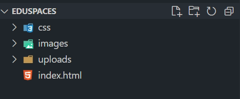
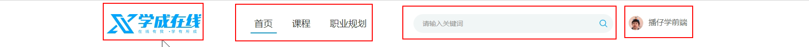
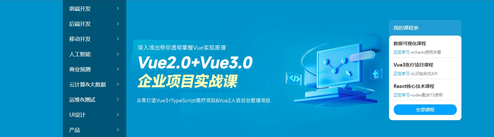
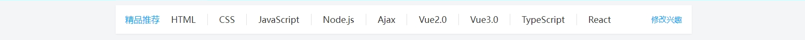
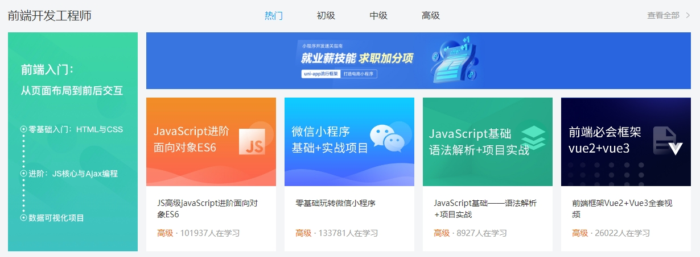
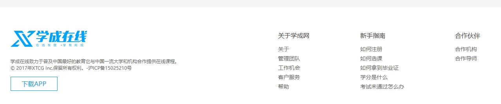

## 学成在线网页制作


### 设置项目目录结构

项目目录是指存放网站的第一层文件夹，内部宝航当前网站的所有素材，包括HTML、CSS、图片、JavaScript等等



- **eduspaces**: 项目目录
    - images: 存放固定使用的图片素材，例如： logo、样式修饰图等
    - css： 存放css文件，使用link标签引入
        - base.css: 基础公共样式，例如清除默认样式、设置王爷基本样式等
        - index.css： index首页css样式
    - index.html: 首页HTML文件

### 设置默认样式

文件： base.css
```css
/* 基础公共样式：清除默认样式 + 设置通用样式 */
* {
    margin: 0;
    padding: 0;
    box-sizing: border-box;
  }
  
  li {
    list-style: none;
  }
  
  body {
    font: 14px/1.5 "Microsoft Yahei", "Hiragino Sans GB", "Heiti SC", "WenQuanYi Micro Hei", sans-serif;
    color: #333;
  }
  
  a {
    color: #333;
    text-decoration: none;
  }
```

### 设置版心

查看设计稿，选择溢出明显的版心区域，设置 index.css 版心居中代码如下

```css
.wrapper {
    margin: 0 auto;
    width: 1200px;
}
```

### 网页制作思路

先整体再局部，从外到内，从上到下，从左到右
CSS 实现思路：

- 先画盒子
    - 宽、高、背景色
- 再布局
    - 调整盒子的内外边距
- 最后调整样式
    - 控制图片、文字内容样式


### 设置网页背景色

```css
body {
    background-color: #f3f5f7;
}
```

### header区域-整体布局

通栏：快读与浏览器窗口相同的盒子
- 标签结构： 通栏>版心>logo+导航+搜索+用户


```html
    <!-- 头部区域 -->
    <div class="header">
       <div class="wrapper">
        <div class="logo">logo</div>
        <div class="nav">nav</div>
        <div class="search">search</div>
        <div class="user">user</div>
       </div>
    </div>
```
```css
/* 设置头部的高度 */
.header {
    height: 100px;
  
}
/* 水平排列 */
.header .wrapper {
    padding-top: 29px;
    display: flex;
}
```
#### logo 

单击跳转到首页，搜索引擎优化，提升完整百度搜索排名
实现方法：
- 标签结构： h1>a>网站关键字， css对a标签进行样式调整

```html
        <div class="logo">
            <h1><a href="#">学成在线</a></h1>
        </div>
```
```css
.logo  a{
    display: block;
    width: 195px;
    height: 41px;
    background-image: url(../images/logo.png);
    /* 隐藏字体 */
    font-size: 0px;
}
```

#### 导航 nav

实现方法：
- 标签： ul>li*3>a
- 优势避免堆砌a标签，导致网站搜索排名降级

```html
        <div class="nav">
            <ul>
                <li><a href="#">首页</a></li>
                <li><a href="#">课程</a></li>
                <li><a href="#">职业规划</a></li>
            </ul>
        </div>
```
```css
.nav {
    margin-left: 102px;
}
.nav ul {
    display: flex;
}

.nav li {
    margin-right: 24px;
}

.nav li a {
    display: block;
    padding: 6px 8px;
    font-size: 19px;
    line-height: 27px;
}

/* active类选择器，表示默认选中 a */
.nav li .active,
.nav li a:hover{
    border-bottom: 2px solid #00a4ff;
}
```

#### 搜索区域

```html
        <div class="search">
            <input type="text" placeholder="请输入关键字">
            <a href="#"></a>
        </div>
```

```css
/* 搜索 */
.search {
    display: flex;
    margin-left: 64px;
    padding-left: 19px;
    padding-right: 12px;
    display: flex;
    width: 412px;
    height: 40px;
    background-color: #f3f5f7;
    border-radius: 20px;
}

.search input {
    flex: 1;   /*占用所有区域*/
    border: 0; /*去掉边框线*/
    background-color: transparent; /*透明*/
    outline: none;/*去掉焦点框*/
}

/* 设置提示文字大小 */
.search input::placeholder {
    font-size: 14px;
    color: #999;
}

/*父级别是flex，子级会继承，成为弹性盒子*/
.search a {
    /* margin: 12px 12px; */
    align-self: center;
    width: 16px;
    height: 16px;
    background-image: url(../images/search.png);
}
```

#### 用户

```html
        <div class="user">
            <a href="#"> 
                
                <span>波仔学前端</span>
            </a>
        </div>
```
```CSS
.user {
    margin-left: 32px;
    margin-top: 4px;
}

/* 行内图片文字垂直居中*/
.user img {
    vertical-align: middle;
    margin-right: 6px;
}

.user span {
    font-size: 16px;
    color: #666;
}
```

### bannar区域-整体布局



```HTML
<!-- banner -->
    <div class="banner">
        <div class="wrapper">
            <div class="left">
                <ul>
                    <li><a href="#">前端开发</a></li>
                    <li><a href="#">后端开发</a></li>
                    <li><a href="#">移动开发</a></li>
                    <li><a href="#">人工智能</a></li>
                    <li><a href="#">商业预测</a></li>
                    <li><a href="#">云计算&大数据</a></li>
                    <li><a href="#">运维&测试</a></li>
                    <li><a href="#">UI设计</a></li>
                    <li><a href="#">产品</a></li>
                </ul>
            </div>
            <div class="right">
                <h3>我的课程表</h3>
                <div class="content">
                    <dl>
                        <dt>数据可视化课程</dt>
                        <dd><span>正在学习</span>- <strong>echart使用步骤</strong></dd>
                    </dl>
                    <dl>
                        <dt>数据可视化课程</dt>
                        <dd><span>正在学习</span>- <strong>echart使用步骤</strong></dd>
                    </dl>
                    <dl>
                        <dt>数据可视化课程</dt>
                        <dd><span>正在学习</span>- <strong>echart使用步骤</strong></dd>
                    </dl> 
                     <a href="#">全部课程</a>
                </div>
            </div>
        </div>
    </div>
```
```css
.banner {
    height: 420px;
    background-color: #0092cb ;
}

.banner  .wrapper {
    display: flex;
    justify-content: space-between;
    height: 420px;
    background-image: url(../uploads/banner.png);
}

/* 侧导航 */
.banner .left {
    padding: 3px 20px;
    width: 191px;
    height: 420px;
    /* background-color: #005576 ; */
    background-color: rgba(0, 0,0, 0.42);
}

.banner .left a {
    display: block;
    height: 46px;
    line-height: 46px;
    background: url(../images/right.png) no-repeat right center;
    font-size: 16px;
    color: #fff;
}
.banner .left a:hover {
    background: url(../images/right-hover.png) no-repeat right center;
   
    color: #0092cb;
    
}


.banner .right {
    margin-top: 60px;
    width: 218px;
    height: 305px;
    background-color: #209dd5;
    border-radius: 10px;
}

/* .banner .right h3 {
    margin-left: 14px;
    margin-top: 18px;
    width: 75px;
    height: 21px;
    font-size: 15px;
    font-weight: 400;
    color: #fff;
} */
.banner .right h3 {
    margin-left: 14px;
    height: 48px;
    line-height: 48px;
    font-size: 15px;
    font-weight: 400;
    color: #fff;
}

.banner .right .content {
    padding: 14px;
    /* width: 218px; */
    height: 257px;
    background-color: #fff;
    border-radius: 10px;
}

.banner .right dl {
    margin-bottom: 12px;
    border-bottom: 1px solid #e0e0e0;
}

.banner .right dt {
    margin-bottom: 8px;
    font-size: 14px;
    line-height: 20px;
    font-weight: 700;
}
.banner .right dd {
    margin-bottom: 8px;
    font-size: 12px;
    line-height: 16px;
    font-weight: 700;
}

.banner .right dd  span {
    color: #00a4ff;
    /* font-weight: 400; */
}
.banner .right dd  strong {
    font-weight: 400;
    color:  #999;
}


.banner .right a {
    display: block;
    width: 190px;
    height: 32px;
    background-color: #00a4ff;
    border-radius: 15px;
    /* 水平居中 */
    text-align: center; 
    /* 垂直居中 */
    line-height: 32px;
    font-size: 15px;
    color: #fff;
}
```

### 推荐区域



```html
    <div class="recommend wrapper">
        <h3>精品推荐</h3>
        <ul>
            <li><a href="#">HTML</a></li>
            <li><a href="#">CSS</a></li>
            <li><a href="#">JavaScript</a></li>
            <li><a href="#">Node.js</a></li>
            <li><a href="#">Ajax</a></li>
            <li><a href="#">Vue2.0</a></li>
            <li><a href="#">Vue3.0</a></li>
            <li><a href="#">TypeScript</a></li>
            <li><a href="#">React</a></li>
        </ul>
        <a href="#" class="modify">修改兴趣</a>
    </div>
```
```CSS
.recommend { 
    display: flex;
    margin-top: 12px;
    padding: 0 20px;
    height: 60px;
    background-color: #fff;
    box-shadow: 0px 1px 2px 0px rgba(211, 211, 211, 0.5);
    line-height: 60px;
}


.recommend h3 {
    font-size: 18px;
    color: #0092cb;
    font-weight: 400;
}

.recommend ul { 
    display: flex;
    flex: 1; 
}

.recommend ul li a {
    padding: 0px 24px;
    border-right: 1px solid ;
    font-size: 18px;
}

.recommend ul li:last-child a {
    border-right: 0px solid ;
}

.recommend .modify {
    font-size: 16px;
    color: #0092cb;
}
```
### 精品推荐


```HTML
<div class="course wrapper">
        <!-- 标题 -->
        <div class="hd">
            <h3>精品推荐</h3>
            <a href="#" class="more">查看全部</a>
        </div>
        <!-- 内容 -->
        <div class="bd">
            <ul>
                <li>
                    <a href="#">
                        <div class="pic"></div>
                        <div class="text">
                            <h4>JavaScript数据看板项目实战</h4>
                            <p><span>高级</span> · <i>1125</i>在学习</p>
                        </div>
                    </a>
                </li>
                <li>2</li>
                <li>3</li>
                <li>4</li>
                <li>5</li>
                <li>6</li>
                <li>7</li>
                <li>8</li>
                <li>9</li>
                <li>10</li>
            </ul>
        </div>
    </div>
```
```css
.course {
    margin-top: 15px;
}

/*标题，公共类，其它区域公用 */
.hd {
    display: flex;
    justify-content: space-between;
    height: 60px;
    line-height: 60px;
    
}

.hd h3 {
    font-size: 21px;
    font-weight: 400;
}
.hd .more {
    padding-right: 20px;
    font-size: 14px;
    color: #999;
    background: url(../images/more.png) no-repeat right center;
}

.bd ul {
    display: flex;
    flex-wrap: wrap;
    justify-content: space-between;
}

/* 课程内容 */
.bd li {
    margin-bottom: 14px;
    width: 228px;
    height: 271px;
    background-color: pink;
}

.bd li .pic {
    height: 156px;

}
.bd li .text {
    padding: 20px;
    height: 115px;
    background-color: #fff;
}

.bd li .text h4 {
    margin-bottom: 13px;
    height: 40px;
    font-size: 14px;
    font-weight: 400;
    line-height: 20px;
}

.bd li .text p {
    height: 40px;
    font-size: 14px;
    line-height: 20px;
    color: #999;
}

.bd li .text span {
    height: 40px;
    font-size: 14px;
    line-height: 20px;
    color: #fa6400;
}
.bd li .text p i {
    font-style: normal;
}
```

### 前端开发工程师



```html
    <div class="wrapper">
        <div class="hd">
            <h3>前端开发工程师</h3>
            <ul>
                <li><a href="#" class="active">热门</a></li>
                <li><a href="#">初级</a></li>
                <li><a href="#">中级</a></li>
                <li><a href="#">高级</a></li>
            </ul>
            <a href="" class="more">查看更多</a>
        </div>
        <div class="bd">
            <div class="left">
                
            </div>
            <div class="right">
                <div class="top"></div>
                <div class="bottom">
                    <ul>
                        <li>
                            <a href="#">
                                <div class="pic"></div>
                                <div class="text">
                                    <h4>JavaScript数据看板项目实战</h4>
                                    <p><span>高级</span> · <i>1125</i>在学习</p>
                                </div>
                            </a>
                        </li>
                        <li>1</li>
                        <li>2</li>
                        <li>3</li>
                    </ul>
                </div>
            </div>
        </div>
    </div>
```

```CSS
.hd ul {
    display: flex;
}

.hd li {
    margin-right: 60px;
    font-size: 16px;
}

.hd li  .active {
    color: #00a4ff;
}

.bd {
    display: flex;
    justify-content: space-between;
}
.bd .left {
    width: 228px;
 
}

.bd .right {
    width: 957px;
}
.bd .right .top {
    margin-bottom: 15px;
    height: 100px;
}
```

### 版权信息



```HTML
    <div class="footer">
        <div class="wrapper">
            <div class="left">
                <a href="#"></a>
                <p>学成在线致力于普及中国最好的教育它与中国一流大学和机构合作提供在线课程。
                    © 2017年XTCG Inc.保留所有权利。-沪ICP备15025210号</p>
                <a href="" class="download">下载APP</a>
            </div>
            <div class="right">
                <dl>
                    <dt>关于学成网</dt>
                    <dd><a href="">合作机构</a></dd>
                    <dd><a href="">合作导师</a></dd>
                </dl>
                <dl>
                    <dt>新手指南</dt>
                    <dd><a href="">合作机构</a></dd>
                    <dd><a href="">合作导师</a></dd>
                </dl>
                <dl>
                    <dt>合作伙伴</dt>
                    <dd><a href="">合作机构</a></dd>
                    <dd><a href="">合作导师</a></dd>
                </dl>
            </div>
        </div>
    </div>
```
```css
.footer {
    margin-top: 60px;
    padding-top: 60px;
    height: 273px;
    background-color: #fff;
}

.footer .wrapper {
    display: flex;
    justify-content: space-between;
}

.footer .left {
    width: 432px;
    /* height: 148px; */
    /* background-color: pink; */
}

.footer .left p {
    margin-top: 24px;
    margin-bottom: 14px;
    font-size: 12px;
    line-height: 17px;
    color: #666;
}

.footer .left .download {
    display: block;
    width: 120px;
    height: 36px;
    border: 1px solid #00a4ff;
    font-size: 16px;
    line-height: 36px;
    text-align: center;
}   

.footer .right  {
    display: flex;
}

.footer .right dl {
    margin-left: 130px;
}
.footer .right dt {
   margin-bottom: 12px;
   font-size: 16px;
   line-height: 23px;
}

.footer .right a {
    font-size: 14px;
    color: #666;
    line-height: 24px;
}
```

