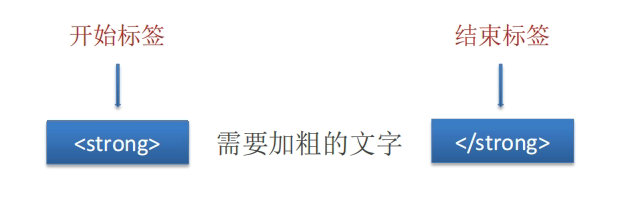
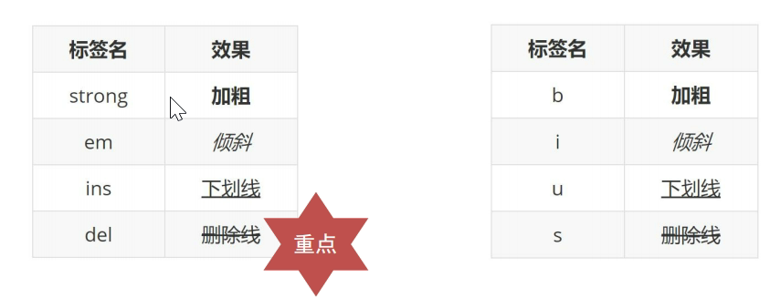
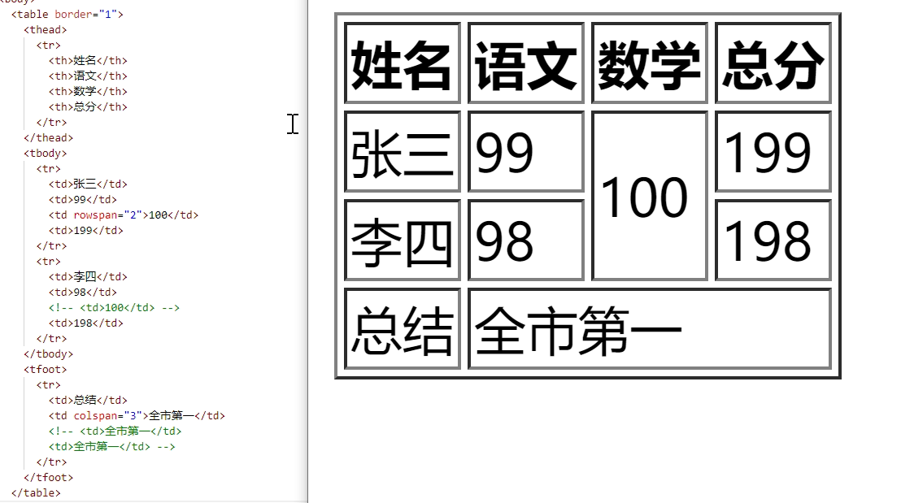
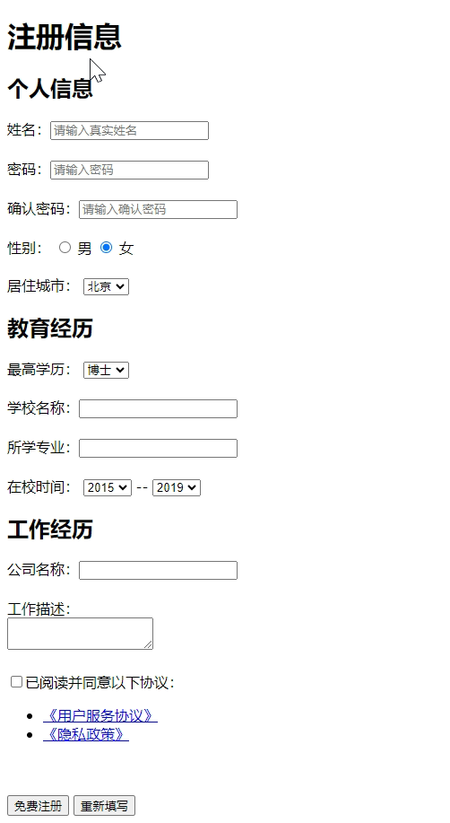

# HTML
[TOC]

## HTML 定义

HTML 超文本标记语言（`HyperText Markuo Language`）
- 超文本: 链接
- 标记: 标记也叫标签，带尖括号的文本

## 标签语法



- 标签成对出现，中间包裹内容
- `<>` 里面放英文字母(标签名)
- 结束标签比开始标签多 `/`
    - 双标签： 成对出现的标签 `<h1>标题1</h1>`
    - 单标签： 只有开始标签，没有结束标签 `<br >`

## HTML 骨架

```HTML
<!DOCTYPE html>
<html lang="en">
<head>
    <meta charset="UTF-8">
    <meta name="viewport" content="width=device-width, initial-scale=1.0">
    <title>Html</title>
</head>
<body>
    网页主体内容
</body>
</html>
```
- html: 整个网页
- head： 网页头部，用来存放浏览器看的信息，例如css
- body：网页主题，用来存放用户看到的信息，例如图片文字

## 标签的关系

- 父子关系（嵌套关系）: 子级标签换行且缩进
```HTML
<html>
    <head></head>
</html>
```

- 兄弟关系(并列关系)：兄弟标签换行要对齐
```HTML
<head></head>
<body></body>
```

## 注释

注释是对代码的解释贺说明 ,在浏览器中不会显示`<!-- ... -->`

## 常见的标签

### 标题标签 - `h#`

标题标签一般用于新闻标题、文章标题、网页区域名称、产品名称等等

 h1 标签在一个网页中只能用一次，用来放新闻标题或网页的 logo

**标签名字：`h1 ~ h6`**

显示特点：
- 文字加粗
- 字号逐渐减小
- 独占一行

###  段落标签 - `p`

一般用在新闻段落、文章段落、产品描述等。

**标签名字`p`**

显示特点：
- 独占一行
- 段落之间存在间隙

### 换行与水平线 - `br` `hr`

单标签
- 换行： `<br >`
- 水平线： `<hr >`

### 文本格式化标签 



### 图像标签 - `img`

在网页中插入图片
- 标签名： `img`
  - src: 图片名称贺位置
  - alt： 替换文本，当图片不存在时显示文字
  - title： 提示文本，苏表悬停在图片上显示的文字
  - width: 图片的宽度
  - height： 图片的高度
```HTML

```

### 超链接- `a`

```HTML
<a href="https://www.baidu.com" target="_blank" >跳转到百度</a>
```
- `target= "_blank"`: 在新窗口打开页面

### 音频标签 - `audio`

```HTML
<audio src="音频的 URL"></audio>
```

- controls: 显示音频控制面板
- loop： 循环播放
- autpplay： 自动播放

### 视频标签

```HTML
<video src="视频的 URL"></video>
```
- controls: 显示音频控制面板
- loop： 循环播放
- autpplay： 自动播放
- muted: 静音播放，为了提升用户体验，浏览器支持在静音状态下播放

### 列表标签 

作用：布局内容排列整齐的区域。
#### 无序列表 - `ul`

ul 标签里面只能包裹 li 标签,li 是列表条目, li 标签里面可以包裹任何内容

```HTML
<ul>
  <li>第一项</li>
  <li>第二项</li>
  <li>第三项</li> 
</ul>
```
#### 有序列表 - `ol`

```HTML
<ol>
  <li>第一项</li>
  <li>第二项</li>
  <li>第三项</li>
</ol>
```

#### 定义列表 - `dl`

dl 嵌套 dt 和 dd，dl 是定义列表，dt 是定义列表的标题，dd 是定义列表的描述 / 详情

```HTML
<dl>
  <dt>列表标题</dt>
  <dd>列表描述 / 详情</dd>
</dl>
```

### 表格 - `table`

网页中的表格与 Excel 表格类似，用来展示数据.

标签：table 嵌套 tr，tr 嵌套 td / th。

```HTML
    <table border="1">
        <tr>
            <th>姓名</th>
            <th>年龄</th>
            <th>性别</th>
        </tr>
        <tr>
            <td>张山</td>
            <td>29</td>
            <td>男</td>
        </tr>
    </table>
```

> 提示：在网页中，表格默认没有边框线，使用 border 属性可以为表格添加边框线

#### 合并单元格



作用：将多个单元格合并成一个单元格，以合并同类信息。
合并单元格的步骤：
- 明确合并的目标
  - 保留最左最上的单元格，添加属性（取值是数字，表示需要合并的单元格数量）
  – 跨行合并，保留最上单元格，添加属性 rowspan
  – 跨列合并，保留最左单元格，添加属性 colspan
- 删除其他单元格

### 表单 - `form`

作用：收集用户信息。
使用场景：
• 登录页面
• 注册页面
• 搜索区域

#### input 基本使用

- text: 文本框，用于输入单行文本
- password: 密码框
- radio： 单选框
- checkbox： 多选框
- file： 文件上传

```HTML
<!-- 特点：输入什么就显示什么 -->
  文本框：<input type="text">
  <br><br>
  <!-- 特点：输入什么都是以 点 的形式显示 -->
  密码框：<input type="password" placeholder="请输入密码">
  <br><br>
  单选框：<input type="radio">
  <br><br>
  多选框：<input type="checkbox">
  <br><br>
  上传文件：<input type="file">
```

#### input 占位符号 - `placeholder`

```HTML
  文本框：<input type="text" placeholder="请输入用户名">
  <br><br>
  密码框：<input type="password" placeholder="请输入密码">
```

#### 单选框 - `radio`

```HTML
  性别：
  <input type="radio" name="gender"> 男
  <input type="radio" name="gender" checked> 女
```

#### 上传文件 - `file`

上传多个文件 
```HTML
 上传文件：<input type="file" multiple>
```

#### 多选框 - `checkbox`

```HTML
  兴趣爱好：
  <input type="checkbox"> 敲代码
  <input type="checkbox" checked> 敲前端代码
  <input type="checkbox" checked> 敲前端 HTML 代码
```

#### 下拉菜单 - `select 嵌套 option`

默认显示第一项，selected 属性实现默认选中功能

```HTML
  城市：
  <select>
    <option>北京</option>
    <option>上海</option>
    <option>广州</option>
    <option>深圳</option>
    <option selected>武汉</option>
  </select>
```

#### 文本域 - `textarea`

作用：多行输入文本的表单控件。

```HTML
  <!-- 工作中，使用 CSS 禁用右下角的拖拽功能；使用 CSS 设置尺寸 -->
  <textarea>请输入评论</textarea>
```

#### label标签
作用：网页中，某个标签的说明文本。用 label 标签绑定文字和表单控件的关系，增大表单控件的点击范围

```HTML
  <input type="radio" name="gender" id="man"> <label for="man">男</label>
  <label><input type="radio" name="gender"> 女</label>
```

```HTML
<!--label 标签只包裹内容，不包裹表单控件  设置 label 标签的 for 属性值 和表单控件的 id 属性值相同-->
<input type="radio" id="man">
<label for="man">男</label>

<!--使用 label 标签包裹文字和表单控件，不需要属性-->
<label><input type="radio"> 女</label> 
```

#### 按钮 - `button`

>  注意：按钮需配合 form 标签（表单区域）才能实现对应的功能

```HTML
<!-- form 表单区域 -->
  <!-- action="" 发送数据的地址 -->
  <form action="">
    用户名：<input type="text">
    <br><br>
    密码：<input type="password">
    <br><br>

    <!-- 如果省略 type 属性，功能是 提交 -->
    <button type="submit">提交</button>
    <button type="reset">重置</button>
    <button type="button">普通按钮</button>
  </form>
```

#### 表单综合案例

```HTML
<!DOCTYPE html>
<html lang="en">
<head>
  <meta charset="UTF-8">
  <meta http-equiv="X-UA-Compatible" content="IE=edge">
  <meta name="viewport" content="width=device-width, initial-scale=1.0">
  <title>注册信息</title>
</head>
<body>
  <h1>注册信息</h1>
  <form action="">
    <!-- 表单控件 -->
    <!-- 个人信息 -->
    <h2>个人信息</h2>
    <label>姓名：</label><input type="text" placeholder="请输入真实姓名">
    <br><br>
    <label>密码：</label><input type="password" placeholder="请输入密码">
    <br><br>
    <label>确认密码：</label><input type="password" placeholder="请输入确认密码">
    <br><br>
    <label>性别：</label>
    <label><input type="radio" name="gender"> 男</label>
    <label><input type="radio" name="gender" checked> 女</label>
    <br><br>
    <label>居住城市：</label>
    <select>
      <option>北京</option>
      <option>上海</option>
      <option>广州</option>
      <option>深圳</option>
      <option>武汉</option>
    </select>
    <!-- 教育经历 -->
    <h2>教育经历</h2>
    <label>最高学历：</label>
    <select>
      <option>博士</option>
      <option>硕士</option>
      <option>本科</option>
      <option>大专</option>
    </select>
    <br><br>
    <label>学校名称：</label><input type="text">
    <br><br>
    <label>所学专业：</label><input type="text">
    <br><br>
    <label>在校时间：</label>
    <select>
      <option>2015</option>
      <option>2016</option>
      <option>2017</option>
      <option>2018</option>
    </select>
    --
    <select>
      <option>2019</option>
      <option>2020</option>
      <option>2021</option>
      <option>2022</option>
    </select>
    <!-- 工作经历 -->
    <h2>工作经历</h2>
    <label>公司名称：</label><input type="text">
    <br><br>
    <label>工作描述：</label>
    <br>
    <textarea></textarea>
    <br><br>
    <!-- 协议 和 按钮 -->
    <input type="checkbox"><label>已阅读并同意以下协议：</label>
    <ul>
      <li><a href="#">《用户服务协议》</a></li>
      <li><a href="#">《隐私政策》</a></li>
    </ul>
    <br><br>
    <button>免费注册</button>
    <button type="reset">重新填写</button>
  </form>
</body>
</html>
```


### 无语义的布局标签 - `div` `span`

- div：独占一行
- span：不换行

### 有语义的布局标签

- header： 网页头部
- nav： 网页导航
- footer 网页底部
- aside： 网页侧标蓝
- section: 网页区块
- article: 网页文章

### 字符实体 

作用：在网页中显示预留字符
- `&nbsp;`： 空格
- `&lt;`: 小于号
- `&gt;`: 大于号


