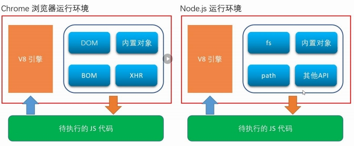
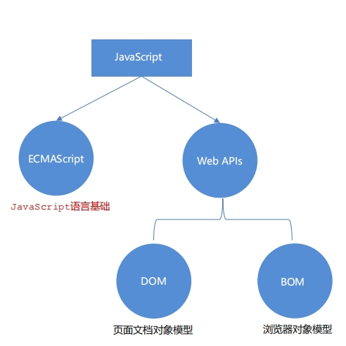
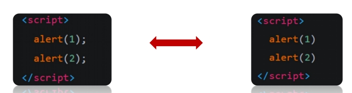

[//]: # ([TOC])

# 

## JavaScript 介绍

###  1. JavaScript 是什么

JavaScript 是一种运行在客户端（浏览器）的编程语言，实现人机交互效果。


作用：
- 网页特效 (监听用户的一些行为让网页作出对应的反馈)
- 表单验证 (针对表单数据的合法性进行判断)
- 数据交互 (获取后台的数据, 渲染到前端）
- 服务端编程 (node.js)

### 2. JavaScript的组成



- ECMAScript: 规定了js基础语法核心知识。
     - 比如：变量、分支语句、循环语句、对象等等
- Web APIs :
     - DOM 操作文档，比如对页面元素进行移动、大小、添加删除等操作
     - p BOM 操作浏览器，比如页面弹窗，检测窗口宽度、存储数据到浏览器等等

## JavaScript 书写位置


### 1. 内部 JavaScript

内部 JavaScript直接写在html文件里，用script标签包住.

我们将 `<script>` 放在HTML文件的底部附近的原因是浏览器会按照代码在文件中的顺序加载 HTML。 如果先加载的 JavaScript 期望修改其下方的 HTML，那么它可能由于 HTML 尚未被加载而失效。 因此，将 JavaScript 代码放在 HTML页面的底部附近通常是最好的策略

```html
<body>
    ...
    <script>
        alert("hello js!!!")
    </script>
</body>
```


### 2. 外部 JavaScript

外部 JavaScript代码写在以.js结尾的文件里,：通过script标签，引入到html页面中。

1. script标签中间无需写代码，否则会被忽略！
2. 外部JavaScript会使代码更加有序，更易于复用，且没有了脚本的混合，HTML 也会更加易读，因此这是个好的习惯。

```bash
$ cat js/test.js
alert("hello js!!!") 
```
```html
<body>
    ...
    <script src="js/test.js"></script>
</body>
```

### 3. 内联 JavaScrip

内联 JavaScrip, 代码写在标签内部。

```html
<body>
    <button onclick="alert('hello js')">点击我</button>
</body>
```

## JavaScript 的注释

- `//`： 单行注释
- `/* */`: 多行注释、块注释

## JavaScript的结束符


- `;`: 英文结束符

实际开发中，可写可不写, 浏览器(JavaScript 引擎) 可以自动推断语句的结束位置
- 现状： 在实际开发中，越来越多的人主张，书写 JavaScript 代码时省略结束符
- 约定：为了风格统一，结束符要么每句都写，要么每句都不写（按照团队要求.）


## 输入和输出语法

输出和输入也可理解为人和计算机的交互，用户通过键盘、鼠标等向计算机输入信息，计算机处理后再展示结果给用户，这便是一次输入和输出的过程

- `document.write('要输出的内容'')`： 像body输出内容，如果输出的是标签也会被解析成网页元素
- `alter('弹窗')`: 页面弹出告警对话框
- `console.log('控制台打印')`: 控制台打印


