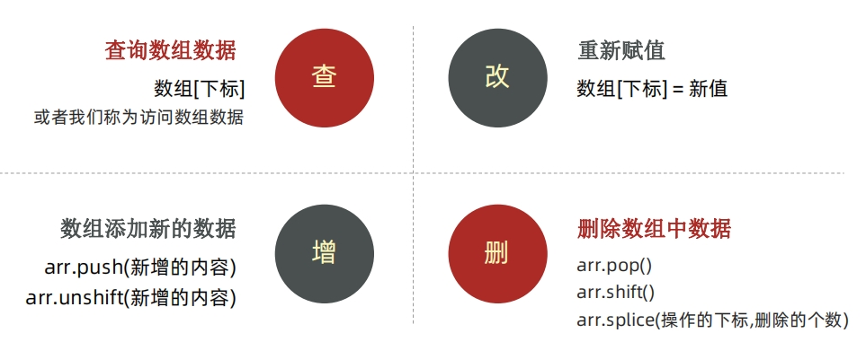

[//]: # ([TOC])

# 

[TOC]

## JavaScript 介绍

###  1. JavaScript 是什么

JavaScript 是一种运行在客户端（浏览器）的编程语言，实现人机交互效果。


作用：
- 网页特效 (监听用户的一些行为让网页作出对应的反馈)
- 表单验证 (针对表单数据的合法性进行判断)
- 数据交互 (获取后台的数据, 渲染到前端）
- 服务端编程 (node.js)

### 2. JavaScript的组成


- ECMAScript: 规定了js基础语法核心知识。
     - 比如：变量、分支语句、循环语句、对象等等
- Web APIs :
     - DOM 操作文档，比如对页面元素进行移动、大小、添加删除等操作
     - p BOM 操作浏览器，比如页面弹窗，检测窗口宽度、存储数据到浏览器等等

## JavaScript 书写位置


### 1. 内部 JavaScript

内部 JavaScript直接写在html文件里，用script标签包住.

我们将 `<script>` 放在HTML文件的底部附近的原因是浏览器会按照代码在文件中的顺序加载 HTML。 如果先加载的 JavaScript 期望修改其下方的 HTML，那么它可能由于 HTML 尚未被加载而失效。 因此，将 JavaScript 代码放在 HTML页面的底部附近通常是最好的策略

```html
<body>
    ...
    <script>
        alert("hello js!!!")
    </script>
</body>
```


### 2. 外部 JavaScript

外部 JavaScript代码写在以.js结尾的文件里,：通过script标签，引入到html页面中。

1. script标签中间无需写代码，否则会被忽略！
2. 外部JavaScript会使代码更加有序，更易于复用，且没有了脚本的混合，HTML 也会更加易读，因此这是个好的习惯。

```bash
$ cat js/test.js
alert("hello js!!!") 
```
```html
<body>
    ...
    <script src="js/test.js"></script>
</body>
```

### 3. 内联 JavaScrip

内联 JavaScrip, 代码写在标签内部。

```html
<body>
    <button onclick="alert('hello js')">点击我</button>
</body>
```

## JavaScript 的注释

- `//`： 单行注释
- `/* */`: 多行注释、块注释

## JavaScript的结束符


- `;`: 英文结束符

实际开发中，可写可不写, 浏览器(JavaScript 引擎) 可以自动推断语句的结束位置
- 现状： 在实际开发中，越来越多的人主张，书写 JavaScript 代码时省略结束符
- 约定：为了风格统一，结束符要么每句都写，要么每句都不写（按照团队要求.）


## 输入和输出语法

输出和输入也可理解为人和计算机的交互，用户通过键盘、鼠标等向计算机输入信息，计算机处理后再展示结果给用户，这便是一次输入和输出的过程

### 1. 输出
- `document.write('要输出的内容'')`： 像body输出内容，如果输出的是标签也会被解析成网页元素
- `alter('弹窗')`: 页面弹出告警对话框
- `console.log('控制台打印')`: 控制台打印

### 2. 输入

- `prompt('请输入你的姓名')`: 显示一个对话框，对话框中包含一条文字信息，用来提示用户输入文字

)

```html
    <!-- <button onclick="alert('hello js')">点击我</button> -->
    <script>
        // document.write("<h1>hello world</h1>")
        // console.log("hello world")
        prompt('请输入你的姓名：')
    </script>
```

## 字面量

在计算机科学中，字面量（literal）是在计算机中描述 事/物

### 1. 变量&常量

变量就是一个装东西的盒子，变量是计算机中用来存储数据的“容器”，它可以让计算机变得有记忆。变量本质：是程序在内存中申请的一块用来存放数据的小空间

常量类似于 let ，但是变量的值无法被修改

- 变量的声明：
     - let: 推荐使用
     - var：以前的声明变量的方式，会有很多问题。会自动提升作用域为全局变量
          - 可以先使用 在声明 (不合理)
          - var 声明过的变量可以重复声明(不合理)
          - 比如变量提升、全局变量、没有块级作用域等等
- 常量的声明:
     - const: 

赋值

```html
        // 先声明再赋值
        let a 
        a = 10
        // 声明的同时并且赋值
        let b = 20
        console.log(a, b)

        // 多值
        let m = 'flex', n = 'float'
        console.log(m,n)

        const PI = 3.14
        console.log(PI)
```

变量/常量命名规则与规范
1. 规则：必须遵守，不遵守报错 (法律层面)
- 不能用关键字 ，关键字：有特殊含义的字符，JavaScript 内置的一些英语词汇。例如：let、var、if、for等
- 只能用下划线、字母、数字、$组成，且数字不能开头
- 字母严格区分大小写，如 Age 和 age 是不同的变量

2. 规范：建议，不遵守不会报错，但不符合业内通识 （道德层面）
- 起名要有意义
- 遵守小驼峰命名法
- 第一个单词首字母小写，后面每个单词首字母大写。例：userName


### 2. 数组的基本使用

数组（Array）是一种将一组数据存储再单个变量名下的优雅方式。数组可以存储任意类型的数据

数组是按顺序保存，所以每个数据都有自己的编号，计算机中的编号从0开始，**不支持负数**

在数组中，数据的编号也叫**索引或下标**

- 定义： `let arr = ['a', 'b', 18, 19， null]`
- 取值：`arr[2]`
- 获取数组的长度：`arr.length`

### 3. 数据类型-基本数据类型

计算机世界中的万事万物都是数据。给数据分类有一下好处：
- 更加充分和高效的利用内存
- 也更加方便程序员的使用数据


模板字符串：使用反引号，使用`${}`引用变量值
```html
       let age = 25
       console.log(1, "我今年" + age + "岁了")
       console.log(1, `我今年${age}岁了`)
```
#### 数字类型（Number）

数学中学习到的数字，可以是整数、小数、正数、负数。JavaScript 中的正数、负数、小数等 统一称为 数字类型，JS 是弱数据类型，变量到底属于那种类型，只有赋值之后，我们才能确认

数字可以有很多操作，比如，乘法 * 、除法 / 、加法 + 、减法 - 等等，所以经常和算术运算符一起。

NaN 代表一个计算错误。它是一个不正确的或者一个未定义的数学操作所得到的结果， NaN 是粘性的。任何对 NaN 的操作都会返回 NaN


#### 数据类型 – 字符串类型（string）

通过单引号（ ''） 、双引号（ ""）或反引号( ` ) 包裹的数据都叫字符串，单引号和双引号没有本质上的区别，推荐使用单引号
1. 无论单引号或是双引号必须成对使用
2. 单引号/双引号可以互相嵌套，但是不以自已嵌套自已（口诀：外双内单，或者外单内双）
3. 必要时可以使用转义符 \，输出单引号或双引号


字符串拼接：
- `+` 运算符 可以实现字符串的拼接, 口诀：数字相加，字符相连

#### 布尔类型（boolean）

表示肯定或否定时在计算机中对应的是布尔类型数据。
它有两个固定的值 true 和 false，表示肯定的数据用 true（真），表示否定的数据用 false（假）。

#### 未定义类型（undefined）

未定义是比较特殊的类型，只有一个值 undefined。只声明变量，不赋值的情况下，变量的默认值为 undefined，一般很少【直接】为某个变量赋值为 undefined。
工作中的使用场景：
我们开发中经常声明一个变量，等待传送过来的数据。
如果我们不知道这个数据是否传递过来，此时我们可以通过检测这个变量是不是undefined，就判断用户是否有数据传递过来

#### null（空类型）

JavaScript 中的 null 仅仅是一个代表“无”、“空”或“值未知”的特殊值，将来有个变量里面存放的是一个对象，但是对象还没创建好，可以先给个null

null 和 undefined 区别：
- undefined 表示没有赋值
- null 表示赋值了，但是内容为空

### 4. 类型检测

通过 typeof 关键字检测数据类型，typeof 运算符可以返回被检测的数据类型。它支持两种语法形式

- 作为运算符： `typeof x` （常用的写法）
- 函数形式： `typeof(x)`
- 
换言之，有括号和没有括号，得到的结果是一样的，所以我们直接使用运算符的写法


### 5. 类型转换

JavaScript是弱数据类型： JavaScript也不知道变量到底属于那种数据类型，只有赋值了才清楚。 例如：使用表单、prompt 获取过来的数据默认是字符串类型的，此时就不能直接简单的进行加法运算，此时需要转换变量的数据类型。

类型转换通俗来说，就是把一种数据类型的变量转换成我们需要的数据类型。

- 隐式转换: 某些运算符被执行时，系统内部自动将数据类型进行转换，这种转换称为隐式转换。
     -  `+` 号两边只要有一个是字符串，都会把另外一个转成字符串
     -  `除了+以外`的算术运算符 比如 - * / 等都会把数据转成数字类型
  
- 显示转换: 编写程序时过度依靠系统内部的隐式转换是不严禁的，因为隐式转换规律并不清晰，大多是靠经验总结的规律,为了避免因隐式转换带来的问题，通常根逻辑需要对数据进行显示转换,自己写代码告诉系统该转成什么类型
     - Number(数据)
         - 转成数字类型
         - 如果字符串内容里有非数字，转换失败时结果为 NaN（Not a Number）即不是一个数字
         - NaN也是number类型的数据，代表非数字
     - parseInt(数据): 只保留整数
     - parseFloat(数据): 可以保留小数
     - String(数据)
     - 变量.toString(进制)

```html
    let a = Number(prompt("请输入第1个数字:"))
    let b = Number(prompt("请输入第2个数字:"))
    document.write(`${a} +${b}=`, a+b)
```

## 运算符

### 1. 赋值运算符

赋值运算符：对变量进行赋值的运算符。

- `=` : 将等号右边的值赋予给左边, 要求左边必须是一个容器
- `+=`
- `-=`
-  `*=`
-  `/=`
- `%=`

### 2. 一元运算符

能够使用一元运算符做自增/自减运算
- 自增：`++`
      - `i++`：先使用，在自增
      - `++i`: 先自增，再使用
- 自减: `--`
      - `i++`：先使用，自减
      - `++i`: 先自减，再使用

```html
    let i = 10
    console.log(i++) // 10
    console.log(++i) // 12
```
```html
    let i = 1
    console.log(i++ + ++i + i) // 1 + 3 + 3=7
```

### 3. 比较运算符

比较两个数据大小、是否相等,比较结果为boolean类型，即只会得到 true 或 false

- `>` ： 左边是否大于右边
- `<`： 左边是否小于右边
- `>=`： 左边是否大于或等于右边
- `<=`： 左边是否小于或等于右边
- `==`： 左右两边值是否相等
- `===`： 左右两边是否类型和值都相等
- `!==`： 左右两边是否不全等

字符串比较，是比较的字符对应的ASCII码, NaN不等于任何值，包括它本身,不同类型之间比较会发生隐式转换所以开发中，如果进行准确的比较我们更喜欢 `===` 或者 `!==`

### 4. 逻辑运算符

逻辑运算符用来解决多重条件判断


### 5. 运算符优先级


## 控制语句


### 1. 表达式和语句

表达式是可以被求值的代码，JavaScript 引擎会将其计算出一个结果。因为表达式可被求值，所以它可以写在赋值语句的右侧。

```HTML
x = 7
3 + 4
num ++
```

语句是一段可以执行的代码,prompt() 可以弹出一个输入框，还有 if语句 for 循环语句等等,语句不一定有值，所以比如 alert() for和break 等语句就 不能被用于赋值。

### 2. 分支语句

分支语句可以让我们有选择性的执行想要的代码

#### 2.1 if分支语句

```html
    // 单分支/双分支
    let a = 700
    if (a > 700) {    //(条件) 括号不可省略
        console.log("NB")
    } else {
        console.log("SB")
    }

    // 多分支
    let score = Number(prompt("请输入你的成绩："))
    if (score >= 80) {
        console.log("优秀")
    } else if (score>=70 && score <80) {
        console.log("良好")
    } else if (score >=60 && score<70) {
        console.log("及格")
    }else {
        console.log("不及格")
    }

    
    

```

#### 2.2 三元运算符

(条件)?满足条件代码:不满足条件的代码

```html
    let num1 = Number(prompt('请输入第1个数'))
    let num2 = Number(prompt('请输入第2个数'))
    document.write((num1>num2 ? num1 : num2))
```

#### 2.3 switch语句

```html
    let day = Number(prompt("请输入今天的日期"))

    switch (day) {
        case 1:
            document.write("星期一")
            break  // 一定要加break，否则代码会穿透执行
        case 2:
            document.write("星期二")
            break
        case 3:
            document.write("星期三")
            break
        case 4:
            document.write("星期四")
            break
        case 5:
            document.write("星期五")
            break
        default:
            document.write("周末")
            break
    }
```

### 3. 循环结构

实现一段代码重复执行

#### 3.1. while循环

重复执行一些操作， while : 在…. 期间， 所以 while循环 就是在满足条件期间，重复执行某些代码。

```html
    let i = 5 // 变量起始值

    while (i>0) { // 没有终止条件，循环会一直执行，造成死循环
        document.write(`你好，第${i}次见面<br>`)
        i-- // 变量变化量（用自增或者自减）
    }
```
continue 退出本次循环，一般用于排除或者跳过某一个选项的时候, 可以使用continue

break 退出整个循环，一般用于结果已经得到, 后续的循环不需要的时候可以使用
```html
    let i = 5
    while (i>0) {
        console.log(`你好，第${i}次见面<br>`)
        if (i === 3) {
            break
        }
        i--
    }
```

#### 3.2 for循环

```html
    let m = 10
    for (let i=0;i<m; i++) {  //声明起始值；终止条件;变量变化量
        console.log(i)
    }
```
```html
    // 变量数组
    let arr = ['a', 'b', 'c', 'd']
    for (i=0;i<arr.length;i++) {
        console.log(arr[i])
    }
```

- continue 退出本次循环，一般用于排除或者跳过某一个选项的时候, 可以使用continue

```html
    for (let i=0;i<5;i++) {
        if (i===2) {
            continue
        }
        console.log(i)  // 0 1 3 4 
    }
```

- break 退出整个for循环，一般用于结果已经得到, 后续的循环不需要的时候可以使用

```html
    for (let i=0;i<5;i++) {
        if (i===2) {
            break
        }
        console.log(i)  // 0 1
    }
```

- for 嵌套循环-九九乘法表

```html
    for (let i=1;i<10;i++) {
        for (let j=1;j<=i;j++) {
            line = `${j}*${i}=` + i*j + '  '
            document.write(line)
            if (j==i) {
                document.write("<br>")
            }
        }
    }

    for (let i=1;i<10;i++) {
        let line = ""
        for (let j=1;j<=i;j++) {
            line += `${j}*${i}=` + i*j + '  '
        }
        console.log(line)
    }
```

## 数组

数组：(Array)是一种可以按顺序保存数据的数据类型

场景：如果有多个数据可以用数组保存起来，然后放到一个变量中，管理非常方便

### 1. 数组的声明

声明数组： `let array = ['a', 'b', 'c', 'd', 1, 2, 3]`

声明方式2： `let array = new Array('a', 'b', 'c', 'd', 1, 2, 3)`

取值： `array[index]`

- 数组是按顺序保存，所以每个数据都有自己的编号
- 计算机中的编号从0开始
- 在数组中，数据的编号也叫索引或下标
- 数组可以存储任意类型的数据（数组元素）

```html
    let array = new Array('a', 'b', 'c', 'd', 1, 2, 3)
    console.log(typeof(array), array[5], array.length) // object 2 7
```

### 2. 数组的遍历

用循环遍历所有元素

```html
    let array = new Array('a', 'b', 'c', 'd', 1, 2, 3)
    
    for (let i=0;i<array.length;i++) {
        console.log(array[i])
    }
```

### 3. 数组的操作

数组本质是数据集合, 操作数据无非就是 增 删 改 查



- `push()`: 方法将一个或多个元素添加到数组的末尾，并返回该数组的新长度 (重点)
- `arr.unshift()`: 方法将一个或多个元素添加到数组的开头，并返回该数组的新长度
- `pop()`: 方法从数组中删除最后一个元素，并返回该元素的值
- `shift()`: 方法从数组中删除第一个元素，并返回该元素的值
- `splice()`: 方法 从指定位置删除指定个数元素，返回数组
- `sort()`: 排序。more升序

```html
        let arr_colocr = ['red', 'blue']

        x = arr_colocr.push('pink')

        console.log(arr_colocr, x) // ['red', 'blue', 'pink'], 3

        y = arr_colocr.unshift('green')
        console.log(arr_colocr, y) //  ['green', 'red', 'blue', 'pink'] 4

        m = arr_colocr.pop()
        console.log(arr_colocr, m)  //  ['green', 'red', 'blue'] 'pink'

        n = arr_colocr.shift()
        console.log(arr_colocr, n) // red', 'blue'] 'green'

        let arr =['a', 'b', 'c', 'd', 'e']
        z = arr.splice(2, 2)
        console.log(arr, z) // ['a', 'b', 'e'] ['c', 'd']
```

### 4. 数组的排序

```html
        let arr = [5, 8, 7, 4, 2, 3, 1, 9, 6]
        // arr.sort() // 升序
        // console.log(arr)

        arr.sort(function (a, b) {
            return b - a
        })
        console.log(arr)
```

## 函数

函数可以把具有相同或相似逻辑的代码“包裹”起来，通过函数调用执行这些被“包裹”的代码逻辑，这么做的优势是有利于精简代码方便复用

函数体是函数的构成部分，它负责将相同或相似代码“包裹”起来，直到函数调用时函数体内的代码才会被执行。函数的功能代码都要写在函数体当中。
### 1. 函数的定义

声明语法与调用， 函数名命名规范
```html
    function fn() { // 声明
        console.log("hello world")  // 函数体
    }

    fn()  // 调用
```

### 2. 函数传参

把要计算的数字传到函数内，极大提高函数的灵活性

```html

    function fn(a, b) {
        return a+b
    }
    console.log(fn(3,4))
```
```html
    // 可变参数
    function fn(x,y,...args  ) {
        console.log(x, y, typeof(args))
        return args
    }
    console.log(fn(3,4, 5, 6, 7))
```

### 3. 函数返回值

当函数需要返回数据出去时，用return关键字

- 在函数体中使用 return 关键字能将内部的执行结果交给函数外部使用
- return 后面代码不会再被执行，会立即结束当前函数，所以 return 后面的数据不要换行写
- return函数可以没有 return，这种情况函数默认返回值为 undefined
- 函数有且只有一个返回值

### 4. 函数的作用域

通常来说，一段程序代码中所用到的名字并不总是有效和可用的，而限定这个名字的可用性的代码范围就是这个名字的作用域。作用域的使用提高了程序逻辑的局部性，增强了程序的可靠性，减少了名字冲突。

- 全局作用域。函数外部或者整个script 有效
- 局部作用域。也称为函数作用域，函数内部有效
- 采取**就近原则**的方式来查找变量最终的值


### 5. 匿名函数

没有名字的函数, 无法直接使用。
- 函数表达式: 将匿名函数赋值给一个变量，并且通过变量名称进行调用 我们将这个称为函数表达式
    - `let fn = function () {}`
- 立即执行函数

## 对象

### 1. 对象的定义

对象是 JavaScript 数据类型的一种。对象数据类型可以被理解成是一种无序的数据集合。它由属性和方法两部分构成。例如描述一个人 ，人有姓名、年龄、性别等信息、还有吃饭睡觉打代码等功能 。如果用多个变量保存则比较散，用对象比较统一

- 声明： `let 对象名 = {}` 或者 `let 对象名 = new Object()`
- 属性： 数据描述性的信息称为属性，如人的姓名、身高、年龄、性别等，一般是名词性的。
    - 属性都是成 对出现的，包括属性名和值，它们之间使用英文 : 分隔
    - 多个属性之间使用英文 , 分隔
    - 属性就是依附在对象上的变量（外面是变量，对象内是属性）
    - 属性名可以使用 "" 或 ''，一般情况下省略，除非名称遇到特殊符号如空格、中横线等
- 方法： 数据行为性的信息称为方法，如跑步、唱歌等，一般是动词性的，其本质是函数

```html
    let person = {
        name: 'dengyouf',
        age: 18,
        sex: 'M',
        sayHello: function() {
            console.log("hello world")
        }
    }

    console.log(person.name)
    console.log(person['sex'])
    person.sayHello()
```


### 2. 对象使用

对象本质是无序的数据集合, 操作数据无非就是 增 删 改 查


### 3. 对象的遍历

for 遍历对象的问题：
- 对象没有像数组一样的length属性,所以无法确定长度
- 对象里面是无序的键值对, 没有规律. 不像数组里面有规律的下标

```html
    let person = {
        name: 'dengyouf',
        age: 18,
        sex: 'M',
        sayHello: function() {
            console.log("hello world")
        }
    }

    for (let k in person) { // k 是获得对象的属性名， 对象名[k] 是获得 属性值
        console.log(person[k])
    }
```


## 算法结构

### 1. 冒泡排序

冒泡排序是一种简单的排序算法。

它重复地走访过要排序的数列，一次比较两个元素，如果他们的顺序错误就把他们交换过来。走访数列的工作是重 复地进行直到没有再需要交换，也就是说该数列已经排序完成

这个算法的名字由来是因为越小的元素会经由交换慢慢“浮”到数列的顶端


```html
        let arr = [5, 8, 7, 4, 2, 3, 1, 9, 6]

        for (let i=0;i<arr.length;i++) {
            for (let j=0;j<arr.length-i; j++) {
                if( arr[j] < arr[j+1] ) {
                    let temp 
                    temp = arr[j+1]
                    arr[j+1] = arr[j]
                    arr[j] = temp
                    // break
                }
            }
            
        }
        console.log(arr)
```